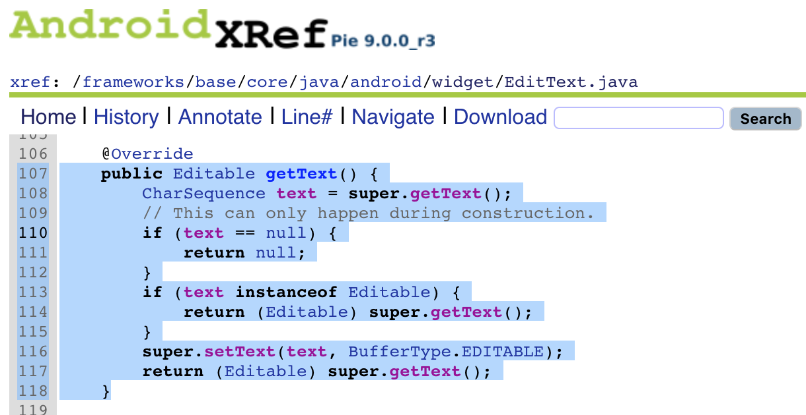
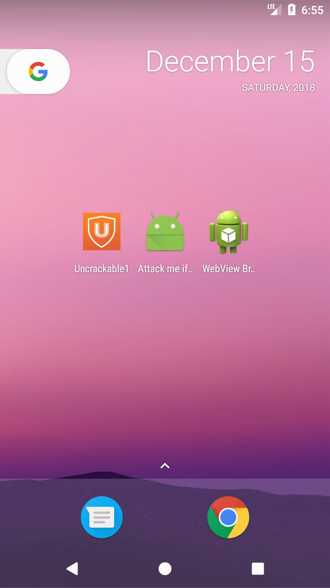

# 0x02 Learning Frida by Failing: Playing with Password Fields on Android

It is good to read articles that show how to do something. It is even better when you are able to reproduce all the steps and it *just works* for you. But what when you would like to try something new? You need to come up with the solution yourself. Alone :)

I will try to show you here how you can learn to *learn by failing*, because failing is actually not always bad. You'll get what I mean in a moment, keep reading. We will not just solve an exercise, we will go deep into the Android docs and Android's source code itself so we can **really understand** why things are like they are.

<center></center>

So yes, **this will take us some time**, take a cup of good coffee because we are going to dive deep into the details.

## These are our tasks

1. [Log all user inputs including password fields](#log-all-user-inputs-including-password-fields)
2. [Manipulate the user input on runtime](#manipulate-the-user-input-on-runtime)
3. [Perform static and dynamic analysis of text fields](#perform-static-and-dynamic-analysis-of-text-fields)

## What are we going to learn along the way?

- How to setup and run a basic hook with Frida
- How to deal with possible errors that we will encounter while writing hooks
- How `EditText` and `inputType` work on Android
- How to use Frida to read the IDs of layout elements like text fields
- How to read the logs of an Android app with `logcat` just by using the package name
- How to convert and calculate stuff with radare2's `rax2`
- The numbers from one to six in Spanish :)
- and more ...

## Log all user inputs including password fields

### The Target

Let's use the OMTG Playground app (you can clone and build the project or just download the APKs [here](https://github.com/OWASP/MSTG-Hacking-Playground/tree/master/Android/OMTG-Android-App/app)). When we want to perform hooks we need normally to do some reverse engineering, I will skip that step here and go straight to the source code that you can view online:


We will focus on this code part of [OMTG_DATAST_002_Logging.java](https://github.com/OWASP/MSTG-Hacking-Playground/blob/master/Android/OMTG-Android-App/app/src/main/java/sg/vp/owasp_mobile/OMTG_Android/OMTG_DATAST_002_Logging.java):

```
import android.widget.EditText;
import android.widget.Toast;

public class OMTG_DATAST_002_Logging extends AppCompatActivity {
    ...
    @Override
    protected void onCreate(Bundle savedInstanceState) {
    ...
        // create click listener for login
        View.OnClickListener oclbtnLogin = new View.OnClickListener() {
            @Override
            public void onClick(View v) {
                CreateLogs(usernameText.getText().toString(), passwordText.getText().toString());
            }
        };

```

We can expect that **when we click on the login button, it will retrieve our text from the text fields** (`EditText` objects).

<center></center>


If this is the first time you hear about this take a look at `EditText.getText` here:

<https://developer.android.com/reference/android/widget/EditText#getText()>

```
public Editable getText ()
Return the text that TextView is displaying.
If setText(CharSequence) was called with an argument of BufferType.SPANNABLE or BufferType.EDITABLE,
you can cast the return value from this method to Spannable or Editable, respectively.
```

If you are really curious, you can [take a look at the source code](http://androidxref.com/9.0.0_r3/xref/frameworks/base/core/java/android/widget/EditText.java#107) in AndroidXRef by [@rchiossi](https://twitter.com/rchiossi):

```java
74      public class EditText extends TextView {
        ...

106    @Override
107    public Editable getText() {
108        CharSequence text = super.getText();
109        // This can only happen during construction.
110        if (text == null) {
111            return null;
112        }
113        if (text instanceof Editable) {
114            return (Editable) super.getText();
115        }
116        super.setText(text, BufferType.EDITABLE);
117        return (Editable) super.getText();
118    }
```


### Preparations

Create a file called `hook_edittext.js` for example. It should contain the following *skeleton*:

```
Java.perform(function () {

  try {
    // Our code snippets go here.
  }
  catch(e) {
    console.log(e.message);
  }

});
```

You will find this `try/catch` ~~unnecessary~~ very handy as no exception will escape unnoticed :)

To run this we get the package of the app, for example with `frida-ps` and `grep` if you just remember that it was something like `..owasp..blabla`:

```
# frida-ps -U | grep owasp
20249  sg.vp.owasp_mobile.omtg_android
```

You could use the PID but I like to use the package because it is fixed. Then to run our code do:

```
frida -U sg.vp.owasp_mobile.omtg_android -l hook_edittext.js
```

The `-U` is for USB device, `-l` means load. You can run, quit with `q` and run again, or just overwrite the file and when you save it it will be automatically re-loaded by Frida.

### Try Número Uno

Our first idea could be to do this:

1. Hook the implementation of `getText`
2. Get the return value
3. Print it to the console
4. Return it so that the app can continue the execution

```
var EditText = Java.use("android.widget.EditText");

EditText.getText.implementation = function () {
    retval = this.getText.call(this);
    console.log("[*] EditText Return: " + retval);
    return retval;
};
```

And this is the output:

```
getText(): has more than one overload, use .overload(<signature>) to choose from:
	.overload()
	.overload()
```

Oops, we forgot to use the overload:
```
var EditText = Java.use("android.widget.EditText");

EditText.getText.overload().implementation = function () {
    retval = this.getText.call(this);
    console.log("[*] EditText Return: " + retval);
    return retval;
};
```

Now there are no exceptions, but the output is:

```
...
[*] EditText Return: [object Object]
[*] EditText Return: [object Object]
[*] EditText Return: [object Object]
[*] EditText Return: [object Object]
[*] EditText Return: [object Object]
[*] EditText Return: [object Object]
[*] EditText Return: [object Object]
...
```

`[object Object], [object Object] ... `? Definitely not what we want.


### Try Número Dos

Oh wait, there was this method to output something in JSON...

```
var EditText = Java.use("android.widget.EditText");

EditText.getText.overload().implementation = function () {
    retval = this.getText.call(this);
    console.log("[*] EditText Return: " + JSON.stringify(retval));
    return retval;
};
```

output:

```
[LGE Nexus 5X::sg.vp.owasp_mobile.omtg_android]->
[*] EditText Return: {"$handle":"0x1f82","$weakRef":17}
[*] EditText Return: {"$handle":"0x2086","$weakRef":19}
[*] EditText Return: {"$handle":"0x20a6","$weakRef":21}
[*] EditText Return: {"$handle":"0x20c6","$weakRef":23}
[*] EditText Return: {"$handle":"0x20e6","$weakRef":25}
[*] EditText Return: {"$handle":"0x211a","$weakRef":27}
[*] EditText Return: {"$handle":"0x1e4a","$weakRef":29}
...
```

:/ (Actually very useful for other tasks, take a note of it for another occasion: `JSON.stringify()`)

### Try Número Tres

Let's just try to get it as a `String`:

```
var EditText = Java.use("android.widget.EditText");
var String = Java.use("java.lang.String");

EditText.getText.overload().implementation = function () {
    retval = this.getText.call(this);
    console.log("[*] EditText Return: " + retval.toString());
    return retval;
};
```

Oh no here it is again:

```
[*] EditText Return: [object Object]
[*] EditText Return: [object Object]
[*] EditText Return: [object Object]
```

### Try Número Cuatro

We try now to build a `String` using its constructor (use `.$new()`):

```
var EditText = Java.use("android.widget.EditText");
var String = Java.use("java.lang.String");

EditText.getText.overload().implementation = function () {
    retval = this.getText.call(this);
    console.log("[*] EditText Return: " + String.$new(retval));
    return retval;
};
```

The output is:

```
[LGE Nexus 5X::sg.vp.owasp_mobile.omtg_android]-> Error: <init>(): argument types do not match any of:
	.overload()
	.overload('java.lang.String')
	.overload('java.lang.StringBuffer')
	.overload('java.lang.StringBuilder')
	.overload('[B')
	.overload('[C')
	.overload('[B', 'int')
	.overload('[B', 'java.lang.String')
	.overload('[B', 'java.nio.charset.Charset')
	.overload('[C', 'int', 'int')
	.overload('[I', 'int', 'int')
	.overload('[B', 'int', 'int')
	.overload('int', 'int', '[C')
	.overload('[B', 'int', 'int', 'java.nio.charset.Charset')
	.overload('[B', 'int', 'int', 'java.lang.String')
	.overload('[B', 'int', 'int', 'int')
    at throwOverloadError (frida/node_modules/frida-java/lib/class-factory.js:2233:1)
    at klass.f (frida/node_modules/frida-java/lib/class-factory.js:1396:1)
    at klass.EditText.getText.overload.implementation (/repl1.js:22:54)
    at f (eval at implement (frida/node_modules/frida-java/lib/class-factory.js:2103:1), <anonymous>:1:277)
Process terminated
```

We cannot build a `String` just by using whatever `retval` is.

But maybe if we add a `.toString()`?:

```
console.log("[*] EditText Return: " + String.$new(retval.toString()));
```

This won't throw an error but it results again into `[Object object]` outputs.

### Try Número Cinco

As we cannot simply use the constructor of `String`, let's try casting:


```
var EditText = Java.use("android.widget.EditText");
var String = Java.use("java.lang.String");

EditText.getText.overload().implementation = function () {
    retval = this.getText.call(this);
    var text = Java.cast(retval, String);
    console.log("[*] EditText Return: " + text);
    return retval;
};
```

Now run:

```
[LGE Nexus 5X::sg.vp.owasp_mobile.omtg_android]-> Error: Cast from 'android.text.SpannableStringBuilder'
to 'java.lang.String' isn't possible
    at ClassFactory.cast (frida/node_modules/frida-java/lib/class-factory.js:744:1)
    at Runtime.cast (frida/node_modules/frida-java/index.js:383:1)
    at klass.EditText.getText.overload.implementation (/repl1.js:22:25)
    at f (eval at implement (frida/node_modules/frida-java/lib/class-factory.js:2103:1), <anonymous>:1:277)
```

It did not work as we wanted but look, the error says that the class `android.text.SpannableStringBuilder` cannot be casted to `java.lang.String`. Let's correct the casting.

### Try Número Seis


```
var EditText = Java.use("android.widget.EditText");
var SpannableStringBuilder = Java.use("android.text.SpannableStringBuilder");

EditText.getText.overload().implementation = function () {
    retval = this.getText.call(this);
    var text = Java.cast(retval, SpannableStringBuilder);
    console.log("[*] EditText Return: " + text);
    return retval;
};
```

This time, we got what we wanted :D

```
[LGE Nexus 5X::sg.vp.owasp_mobile.omtg_android]->
[*] EditText Return:
[*] EditText Return:
..
[*] EditText Return:
[*] EditText Return:
[*] EditText Return: o
..
[*] EditText Return: o
..
[*] EditText Return: o
[*] EditText Return: o
[*] EditText Return: oa
[*] EditText Return: oa
..
[*] EditText Return: oa
[*] EditText Return: oas
..
[*] EditText Return: oas

```

It keeps printing as we type.

It is important to note that we could have just taken a look into the code of `EditText.getText`. If you remember, at the beginning of the article we have seen already something that would have helped here:

<center></center>

See that `CharSequence text = super.getText();`? Yes we could just have used [that](http://androidxref.com/9.0.0_r3/xref/frameworks/base/core/java/android/widget/EditText.java#107):

```
var EditText = Java.use("android.widget.EditText");
var CharSequence = Java.use("java.lang.CharSequence");

EditText.getText.overload().implementation = function () {
    retval = this.getText.call(this);
    var text = Java.cast(retval, CharSequence);
    console.log("[*] EditText Return: " + text);
    return retval;
};
```

This works as well as the other code but you won't be able to take a look at the original code in other cases so it's good that you learn how to deal with those errors and castings. If you are curious and want to understand why that Spannable-thingy came, just take into account that `EditText` [inherits](https://docs.oracle.com/javase/tutorial/java/IandI/subclasses.html) from `TextView` (that's why we see that it calls `super.`) and look at the `TextView.getText` code [here](http://androidxref.com/9.0.0_r3/xref/frameworks/base/core/java/android/widget/TextView.java#2160).


### Full Code

Here's the full code if you just want to copy paste it:
```
Java.perform(function () {
  try {
    var EditText = Java.use("android.widget.EditText");
    var SpannableStringBuilder = Java.use("android.text.SpannableStringBuilder");

    EditText.getText.overload().implementation = function () {
        retval = this.getText.call(this);
        var text = Java.cast(retval, SpannableStringBuilder);
        console.log("[*] EditText Return: " + text);
        return retval;
    };
  }
  catch(e) {
    console.log(e.message);
  }

});
```

Save it as `hook_editText.js` and run it like this:

```bash
frida -U sg.vp.owasp_mobile.omtg_android -l hook_editText.js
```

## Manipulate user input on runtime

Once here, why not changing the output? Just for fun.

```
return retval;
```

```
return 'hola';
```

Run it ...

```
[*] EditText Return:
Error: Implementation for getText expected return value compatible with 'android.text.Editable'.
    at f (eval at implement (frida/node_modules/frida-java/lib/class-factory.js:2103:1), <anonymous>:1:636)
Process terminated
```

Time to learn again :)

Let's change our hook. We have seen that `EditText.getText` returns a `SpannableStringBuilder`. If we look again in the code we see that when we click the button it also calls the `toString()` method:

```
CreateLogs(usernameText.getText().toString(), passwordText.getText().toString());
```

Let's hook that method and change its output:

```
var SpannableStringBuilder = Java.use("android.text.SpannableStringBuilder");
SpannableStringBuilder.toString.overload().implementation = function () {
    retval = this.toString.call(this);
    console.log("[*] SpannableStringBuilder Return: " + retval);
    return 'holaaaaa';
};
```

In order to verify if our hook is actually effective we can take a look at the logs in `logcat` before and after the hook (by the way this spoils the solution to the `OMTG_DATAST_002_Logging` exercise):

```
adb shell 'logcat --pid=$(pidof -s sg.vp.owasp_mobile.omtg_android)'
```

We will give `user: myuser` and `password: mypassword` in both cases:

Before running the hook:

```
sg.vp.owasp_mobile.omtg_android E/OMTG_DATAST_002_Logging:
User successfully logged in. User: myuser Password: mypassword
```

While running the hook:

```
sg.vp.owasp_mobile.omtg_android E/OMTG_DATAST_002_Logging:
User successfully logged in. User: holaaaaa Password: holaaaaa
```

## Perform static and dynamic analysis of text fields

Imagine you are responsible for verifying that the password fields of a target app are correctly setup. How can we do this? And I mean, **REALLY verify** this, not just by writing something in the password field and checking if it is turned into a set of points :)

We will take two approaches: static and dynamic analysis.

### Static Analysis

Let's take a look in the layout XML file corresponding to the current activity [content_omtg__datast_002__logging.xml](https://github.com/OWASP/MSTG-Hacking-Playground/blob/86840fd7010d9785b339d6d7b5c1c604e77301c0/Android/OMTG-Android-App/app/src/main/res/layout/content_omtg__datast_002__logging.xml#L20):

```
<EditText
     android:id="@+id/loggingUsername"
     android:layout_width="match_parent"
     android:layout_height="wrap_content"
     android:layout_centerHorizontal="true"
     android:layout_below="@id/loggingTextView"
     android:hint="@string/title_activity_omtg__datast_002__logging_username"/>

 <EditText
     android:id="@+id/loggingPassword"
     android:layout_width="match_parent"
     android:layout_height="wrap_content"
     android:layout_centerHorizontal="true"
     android:layout_below="@id/loggingUsername"
     android:inputType="textPassword"
     android:hint="@string/title_activity_omtg__datast_002__logging_password"/>
```

We see that `loggingUsername` does not have an `inputType`, so it will be the default (`TYPE_CLASS_TEXT | TYPE_TEXT_FLAG_MULTI_LINE` -> `131073`).

`loggingPassword` has an `inputType` and it is `textPassword`.

```
textPassword	81	Text that is a password.
Corresponds to InputType.TYPE_CLASS_TEXT | InputType.TYPE_TEXT_VARIATION_PASSWORD.
```

The `81` is in hex, also `0x81`. I like to use radare2 for this stuff as well, run this command `rax2 0x81` -> `129`. See `rax2` help for more.

Reference and recommendations on how to set values in the layout XML can be found [here](https://developer.android.com/training/keyboard-input/style).


#### Did you noticed the `|` when setting the inputType?

The operator `|` is a bitwise logical `or` (also used as `^`).

```
InputType.TYPE_CLASS_TEXT -> 1
InputType.TYPE_TEXT_VARIATION_PASSWORD -> 128
```

You can also use rax2 to calculate that (`=10` for base 10): `rax2 =10 1^128` -> `129`.

The bitwise operation is `00000001b ^ 10000000b = 10000001b`.


#### What about the `android:password` attribute for `TextField`?

You probably already have seen or heard about the attribute [`android:password`](https://developer.android.com/reference/android/widget/TextView#attr_android:password) before. Even if in the docs it's not set as such, it seems that is deprecated, see [here](http://androidxref.com/9.0.0_r3/xref/frameworks/base/core/res/res/values/attrs.xml#4669):

```xml
4669        <!-- Whether the characters of the field are displayed as
4670             password dots instead of themselves.
4671             {@deprecated Use inputType instead.} -->
4672        <attr name="password" format="boolean" />
```

So better stick to `inputType` and use it correctly.

### Dynamic Analysis

`EditText` inherits from `TextView`, which offers a method called [getInputType](https://developer.android.com/reference/android/widget/TextView#getInputType()).

Let's add it to our hook. I've added an extra line to get the layout ID as well.

```
console.log("[*] EditText Layout Id: " + this.getResources().getResourceName(this.getId()));
console.log("[*] EditText inputType: " + this.getInputType());
```

If we run the script with these new lines we get the following:

```
[*] EditText Return:
[*] EditText Layout Id: sg.vp.owasp_mobile.omtg_android:id/loggingUsername
[*] EditText inputType: 131073
[*] EditText Return:
[*] EditText Layout Id: sg.vp.owasp_mobile.omtg_android:id/loggingPassword
[*] EditText inputType: 129
```

`loggingUsername` has `131073` (0x20001 in hex). That is the default EditText InputType in Android:

```
InputType.TYPE_CLASS_TEXT | InputType.TYPE_TEXT_FLAG_MULTI_LINE
```

`loggingPassword` has `129` (0x81 in hex) which corresponds to:

```
InputType.TYPE_CLASS_TEXT | InputType.TYPE_TEXT_VARIATION_PASSWORD
```


## Final Comments

We were able not only to solve the `OMTG_DATAST_002_Logging` exercise but to learn how to solve problems that might arise when writing hooks with Frida, to read the docs and the source code if necessary, because this is the only way to really understand something, just by going deeper and getting our hands dirty. I hope you have found this article interesting and learned a couple of things here, all things I've promised at the [beginning](#what-are-we-going-to-learn-along-the-way) and more.

> If you have comments, feedback or questions feel free to reach me on Twitter :)

[@grepharder](https://twitter.com/grepharder)
