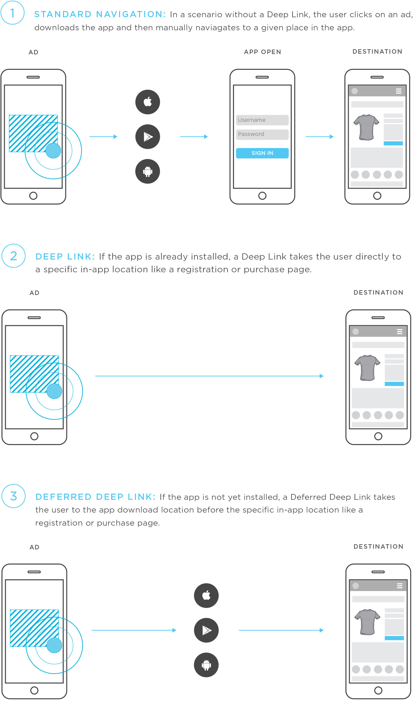
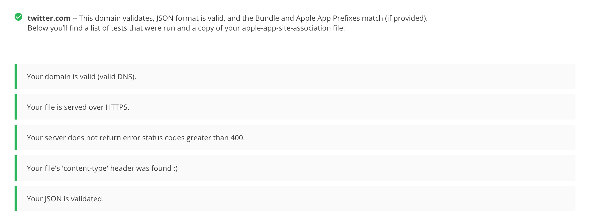
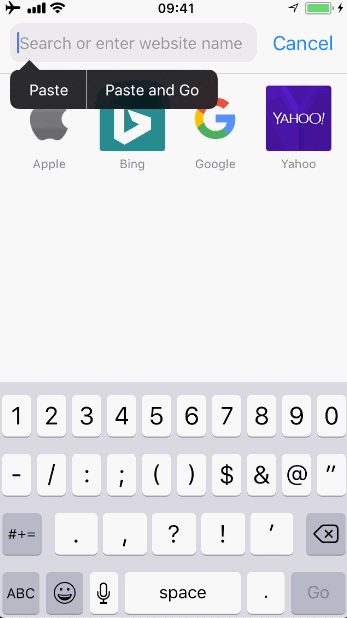
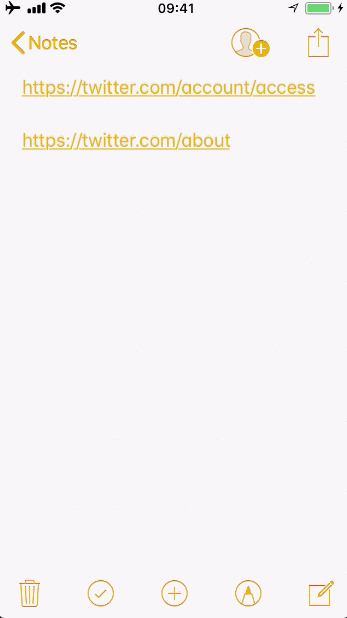
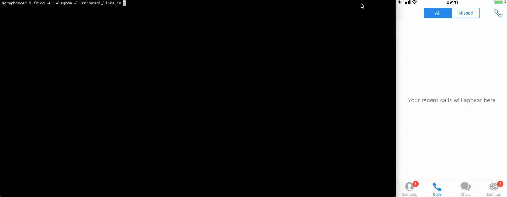
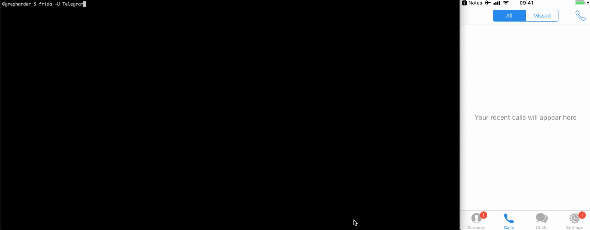
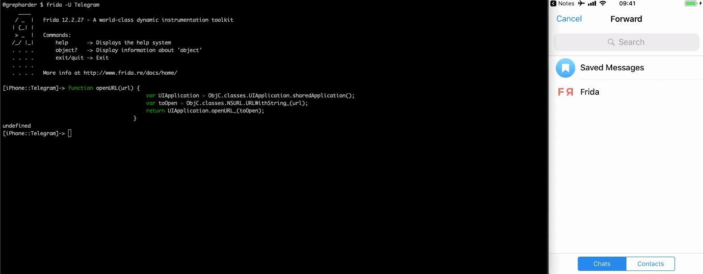

# 0x03 Learning about Universal Links and Fuzzing URL Schemes on iOS with Frida

Ever wondered what happens under-the-hood when you click on a telephone number on a webpage or email? Or why is it possible that you click on a link to the Android Play or Apple App Store and it opens your app instead of opening that as a normal link.

We will:
- learn what Universal Links are and identify the ones that are being used by an app
- learn what URL Schemes are and identify the ones that are being used by an app
- call Universal Links and URL Schemes manually and with Frida
- use of Frida's Interceptor and learn some method calling convention basics on iOS
- use URL Schemes to open a chat or add stickers in Telegram
- fuzz a URL scheme of the iGoat-Swift app


## Universal Links

Universal Links on iOS (App Links for Android) are used as part of a this *technique* is called deep linking. A Universal Link looks like a *regular* link (e.g. `https://`), but when you click on it, it opens the related app instead of the browser. It is important to note that they are **not redirects**.

This picture from [kovacha](https://www.kochava.com/smartlinks/) summarizes this:

<center></center>

But how can we test them? First of all we will do some information gathering, let's inspect what the target app will accept/reject as a Universal Link. For this we need the `apple-app-site-association` file from the app server. It must be there for this to work. Normally it is found at `https://<domain>/apple-app-site-association` or `https://<domain>/.well-known/apple-app-site-association`. We will use this tool: [https://branch.io/resources/aasa-validator/](https://branch.io/resources/aasa-validator/) as it will also give us some extra information.

Example from twitter.com:

```
{
	"applinks": {
		"apps": [],
		"details": [
			{
				"appID": "YV88822DH9.com.twitter.dogfood.internal",
				"paths": [
					"NOT /about",
					"/account/access",
					"/account/confirm_email_reset",
					"/account/login-token",
					"NOT /account/*",
					"NOT /adspolicy",
					"NOT /api_rules",
					"NOT /apirules",
			...
```

<center></center>

Let's trigger ourselves some Universal Links. A GIF is worth thousand words. First open `/about` from the Notes app (Safari won't let us), we see only one option to open it (in the browser).

<center></center>

Opening (`/account/access`) shows options to open it in Safari and in Twitter:

<center></center>

You can do the same straight from Frida, just remember to do it from another app that is not the target app. If not, deep linking won't work.

```
[iPhone::iGoat-Swift]-> openURL("https://twitter.com/account/access")
true
[iPhone::iGoat-Swift]-> openURL("https://twitter.com/about")
true
```

This will open the first in Twitter and the second in Safari. But if you do it from Twitter itself:

```
[iPhone::Twitter]-> openURL("https://twitter.com/account/access")
true
[iPhone::Twitter]-> openURL("https://twitter.com/about")
true
```

Both will open in Safari. Give it a try!

### Using Frida's Interceptor

Let's write some Frida hooks to inspect the opening of the links and repeat the process. The [`application:continueUserActivity:restorationHandler:`](https://developer.apple.com/documentation/uikit/uiapplicationdelegate/1623072-application) method and the class  `NSConcreteURLComponents` will help up to take a first look into what is happening internally (as always be sure to take a look into the documentation).

How I came up with these two methods? Well, `application:continueUserActivity:restorationHandler:` [must be implemented in order to use Universal Links](https://developer.apple.com/library/archive/documentation/General/Conceptual/AppSearch/UniversalLinks.html#//apple_ref/doc/uid/TP40016308-CH12-SW2). To find `initWithURL:resolvingAgainstBaseURL:` I had to trace a little bit with Frida, tracing all combinations of classes like `NSURL*` until I found the method I was interested in. It is not being actively called by the app so you won't even find it in the source code. Actually I searched for it and only found this:

```
+ (MTSignal *)_appleMapsLocationContentForURL:(NSURL *)url
{
    NSURLComponents *urlComponents = [NSURLComponents componentsWithURL:url resolvingAgainstBaseURL:false];
    NSArray *queryItems = urlComponents.queryItems;

```

This is not related to what we are doing now.


To implement the hooks we will use [Frida's Interceptor](https://www.frida.re/docs/javascript-api/#interceptor):

<script src="https://gist.github.com/grepharder/7a6c1b64f5e8eecf78ca076140ac09ec.js"></script>

When we open the link we can observe how the mentioned method is being called. We can also see how the link is resolved using `-[__NSConcreteURLComponents initWithURL:resolvingAgainstBaseURL:]`:

```
[iPhone::Telegram]->
[*] (-[NSURLComponents description]: <NSURLComponents 0x1c00125c0>) initWithURL:resolvingAgainstBaseURL: @ 0x188194a5e
initWithURL: https://telegram.me/fridadotre
resolvingAgainstBaseURL: 0x1
RET @ 0x1c00125c0:
<NSURLComponents 0x1c00125c0> {scheme = https, user = (null), password = (null), host = telegram.me,
	port = (null), path = /fridadotre, query = (null), fragment = (null)}
ret (scheme=https, host=telegram.me, path=/fridadotre)

[*] (<AppDelegate: 0x123d48200>) application:continueUserActivity:restorationHandler: @ 0x18c02205d
application: <Application: 0x123d00ac0>
continueUserActivity: <NSUserActivity: 0x1c04202c0>
continueUserActivity.webpageURL: https://telegram.me/fridadotre
restorationHandler: <__NSStackBlock__: 0x16eee6898>
RET @ 0x1:
0x1
```

<center></center>

### Interceptor Context and iOS Method Calling Convention

Let's use the previous example to learn a bit more about the Interceptor.

This is a generic Objective-C method declaration:
```
int SomeClass_method_foo_(SomeClass *self, SEL _cmd, NSString *str) { ...
```

So very simple said, and talking about registers, we will find the calling class in `x0`, the selector or method name in `x1`, starting on `x2` we will find the method input arguments.

This is the method declaration of `application:continueUserActivity:restorationHandler:`:
```
- (BOOL)application:(UIApplication *)application
continueUserActivity:(NSUserActivity *)userActivity
 restorationHandler:(void (^)(NSArray<id<UIUserActivityRestoring>> *restorableObjects))restorationHandler;
```

We will extend the output by introducing the Context and then analyze the values, our new output is:

```
[*] (<AppDelegate: 0x105146580> @ 0x105146580) application:continueUserActivity:restorationHandler: @ 0x18c02205d
application: <Application: 0x1051446a0>
continueUserActivity: <NSUserActivity: 0x1c0a30600>
continueUserActivity.webpageURL: https://telegram.me/fridadotre
restorationHandler: <__NSStackBlock__: 0x16f7a6898>
Context information:
Context  : {"pc":"0x100685844","sp":"0x16f7a6890","x0":"0x105146580","x1":"0x18c02205d","x2":"0x1051446a0",
"x3":"0x1c0a30600","x4":"0x16f7a6898","x5":"0x1","x6":"0x10b9537d0","x7":"0x810","x8":"0x1c0a30600",
"x9":"0x18c02205d","x10":"0x1058fb000","x11":"0x1b0000003f","x12":"0x1058fb1d0","x13":"0x185a100770f15",
"x14":"0x0","x15":"0x7f7e20","x16":"0x10b12c000","x17":"0x10b0d1720","x18":"0x0","x19":"0x1c0a30600",
"x20":"0x1051446a0","x21":"0x18c02205d","x22":"0x105146580","x23":"0x1c4a76280","x24":"0x1b2a00c60",
"x25":"0x14","x26":"0x1c4e65d40","x27":"0x0","x28":"0x2ffffff","fp":"0x16f7a68e0","lr":"0x18b4f9a48"}
Return   : 0x18b4f9a48
ThreadId : 771
Depth    : 0
Errornr  : undefined
RET: 0x1
```

We found the following information:

- The calling class: "x0":"0x105146580" -> `<AppDelegate: 0x105146580>`
- The selector (method name): "x1":"0x18c02205d" -> `application:continueUserActivity:restorationHandler:`
- The first parameter: "x2":"0x1051446a0" -> `<Application: 0x1051446a0>`
- The second parameter: "x3":"0x1c0a30600" -> `<NSUserActivity: 0x1c0a30600>`
- The third parameter: "x4":"0x16f7a6898" -> `<__NSStackBlock__: 0x16f7a6898>`
- The return value: -> `(BOOL) 0x1`

## URL Schemes

When you click on a telephone number, a `tel://` URL scheme is there waiting to take you to the Phone app. It will simply open your Phone app and call the given number. Internally the Phone app is ready for this. It is always waiting that an URL request starting with `tel://` arrives. If you are reading this from your iPhone or iPad try clicking this: [tel://12345678](tel://12345678), it will try to call 12345678.

<center></center>


Some examples of these URL schemes are:

```
Apple Music — music:// or musics:// or audio-player-event://
Calendar — calshow:// or x-apple-calevent://
Contacts — contacts://
Diagnostics — diagnostics:// or diags://
GarageBand — garageband://
iBooks — ibooks:// or itms-books:// or itms-bookss://
Mail — message:// or mailto://emailaddress
Messages — sms://phonenumber
Notes — mobilenotes://
```

Of course, if the app is well-known you will be able to find several URL Schemes online. For example, a [quick Google search reveals](https://stackoverflow.com/questions/10424275/how-can-i-open-a-twitter-tweet-using-the-native-twitter-app-on-ios):

```
twitter://user?screen_name=lorenb
twitter://user?id=12345
twitter://status?id=12345
twitter://timeline
twitter://mentions
twitter://messages
twitter://list?screen_name=lorenb&slug=abcd
twitter://post?message=hello%20world
...
```

In order to test them we will:
- See which ones does the app register so that other apps can call them
- See which ones does the app intend to call from other apps


In order to find out which URL schemes does the target app support we can look it up inside the `Info.plist` file.
Let's take a look at [Telegram's `Info.plist` file](https://github.com/peter-iakovlev/Telegram-iOS/blob/master/Telegram-iOS/Info.plist).

```
<key>CFBundleURLTypes</key>
<array>
	<dict>
		<key>CFBundleTypeRole</key>
		<string>Viewer</string>
		<key>CFBundleURLName</key>
		<string>$(PRODUCT_BUNDLE_IDENTIFIER)</string>
		<key>CFBundleURLSchemes</key>
		<array>
			<string>telegram</string>
		</array>
	</dict>
```

We see that the `telegram://` is supported. However we will see later that this is not the only scheme supported.

Now let's find out the URL schemes that the app might call. For this search the `Info.plist` for the `LSApplicationQueriesSchemes` key or search the app binary for common URL schemes, use the string `://` or build a regular expression to match URLs, e.g. using radare2 or rabin2.

This is the (truncated) array of schemes for the Telegram app:

```
<key>LSApplicationQueriesSchemes</key>
<array>
	<string>instagram</string>
	<string>googledrive</string>
	<string>yandexmaps</string>
	<string>comgooglemaps</string>
	<string>youtube</string>
	<string>twitter</string>
	...
</array>
```

If we look [into the code](https://github.com/peter-iakovlev/Telegram-iOS/blob/87e0a33ac438c1d702f2a0b75bf21f26866e346f/Telegram-iOS/AppDelegate.swift#L620) we can see an example of how Telegram uses URL schemes:

```
openAppStorePage: {
		let appStoreId = BuildConfig.shared().appStoreId
		if let url = URL(string: "itms-apps://itunes.apple.com/app/id\(appStoreId)") {
				UIApplication.shared.openURL(url)
		}
},
```

You will notice that `itms-apps://` is not in `LSApplicationQueriesSchemes`, this is because it is not a custom URL scheme. It is part of the built-in schemes (e.g. tel/sms/imessage/facetime). Apps don't need to register Apple built-in schemes in `LSApplicationQueriesSchemes`.


A little research reveals that we can use this to open a chat or send a message:

```
tg://resolve?domain=fridadotre
tg://resolve?domain=radare
tg://msg?text=Hola
```

It uses the `tg://` scheme instead of `telegram://`.

If we simply want to call it we can of course use Frida, open a session via CLI to the Telegram app and paste this function:

```
function openURL(url) {
   var UIApplication = ObjC.classes.UIApplication.sharedApplication();
   var toOpen = ObjC.classes.NSURL.URLWithString_(url);
   return UIApplication.openURL_(toOpen);
}
```

Then use it to send a message with `tg://msg?text=`:

<center></center>

Even better, add some cool stickers:

<center></center>

### Fuzzing URL Schemes

Now that we know 2 of the URL schemes that trigger some functionality in the app, we can build a fuzzer for them and call the `openURL` function with different fuzzing payloads. We will know if the app crashed if a crash report (`.ips`) is generated in `/private/var/mobile/Library/Logs/CrashReporter`.

For this we will use a script from [Frida CodeShare](https://codeshare.frida.re/@dki/ios-url-scheme-fuzzing/) (credits for [@dki](https://codeshare.frida.re/@dki)). We had to slightly modify it as it did not work on iOS 11.1.2. Find the updated version here:

<script src="https://gist.github.com/grepharder/4b0724f56d7c451e240a38a7ddd56bc2.js"></script>

As an example we will fuzz the [iGoat-Swift app](https://github.com/OWASP/iGoat-Swift). From the static analysis we know that it supports the following URL scheme and parameters: `iGoat://?contactNumber={0}&message={0}`.

Copy the whole script and store it as `ios-url-scheme-fuzzing.js`. It is important to run this from another app (e.g. the SpringBoard app), if we run it from the target app itself we won't be able to detect the crashes as the Frida script will also crash with the app.

```javascript
$ frida -U iGoat-Swift -l ios-url-scheme-fuzzing.js
[iPhone::SpringBoard]-> fuzz("iGoat", "iGoat://?contactNumber={0}&message={0}")
```

<center></center>


## Final Comments

So, no, no results :/ Unfortunately you cannot always expect to have some findings. But at least I hope you have, as always, learn something new today.


> If you have comments, feedback or questions feel free to reach me on Twitter :)

[@grepharder](https://twitter.com/grepharder)
