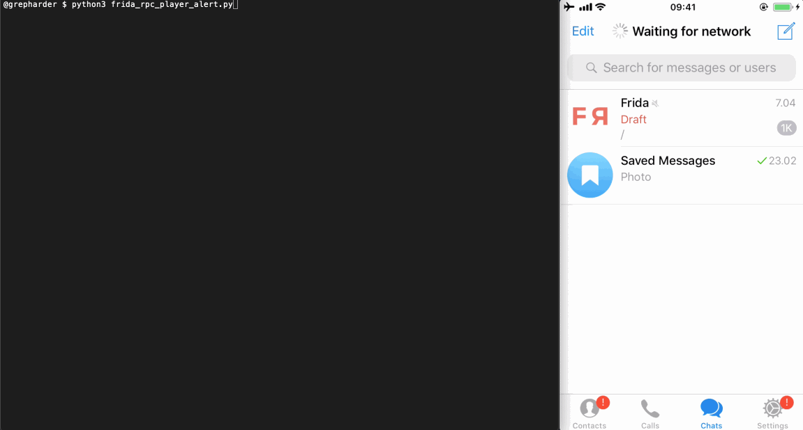

# 0x04 Calling iOS Native Functions from Python Using Frida and RPC

Today we'll learn how to use Frida's [`NativeFunction`](https://www.frida.re/docs/javascript-api/#nativefunction) in order to create and call iOS native functions from Python. We'll then go one step further and use RPC to call the same (remote) iOS functions as if they were local Python functions.

<center></center>

The initial inspiration for this blog post came from a funny tweet by [@CodeColorist](https://twitter.com/CodeColorist/status/1083780561104134144) a while ago.

<center></center>

If you haven't tried to run the mentioned line yet, please do it. Open the Frida REPL and type it:

```javascript
 new NativeFunction(Module.findExportByName('AudioToolbox', 'AudioServicesPlaySystemSound'), 'void', ['int'])(1007)
```

## Let's Dissect the one-liner

So, what's actually happening here? The line is calling the `AudioServicesPlaySystemSound` *function* from the `AudioToolbox` *framework*.

> The [Audio Toolbox framework](https://developer.apple.com/documentation/audiotoolbox?language=objc) provides interfaces for recording, playback, and stream parsing.
> It includes System Sound Services, which provides a C interface for playing short sounds and for invoking vibration on iOS devices that support vibration.

In terms of Frida:

- a *framework* -> a module object
- a *function* -> a native function object for that method / export of that module

Now we can dissect and rewrite the JavaScript one-liner like this:

```javascript
var address = Module.findExportByName('AudioToolbox', 'AudioServicesPlaySystemSound')
var play_sound = new NativeFunction(address, 'void', ['int'])
play_sound(1007)
```

This reveals now each of the steps involved:
- get the absolute address of that export living inside a module
- create a native function object with the correct return value and input parameters
- call a native function using custom parameters

Let's explore and understand each of them.

### Getting the Absolute Address of an Export

The function that we need is `AudioServicesPlaySystemSound`. This function is exported by the `AudioToolbox` module. You can optionally verify it this way:

```javascript
[iPhone::Telegram]-> Module.enumerateExportsSync('AudioToolbox')
...
{
    "address": "0x186cf4e88",
    "name": "AudioServicesPlaySystemSound",
    "type": "function"
},
{
    "address": "0x186cf4e70",
    "name": "AudioServicesPlaySystemSoundWithCompletion",
    "type": "function"
},
{
    "address": "0x186cf3f58",
    "name": "AudioServicesPlaySystemSoundWithOptions",
    "type": "function"
},
...
```

This is how to get the absolute address of that export via `Module.findExportByName(moduleName, exportName)` (part of Frida's [`Module`](https://www.frida.re/docs/javascript-api/#module) API):

```javascript
var address = Module.findExportByName('AudioToolbox', 'AudioServicesPlaySystemSound')
```

> As you may expect it is the same address as we've seen above (`0x186cf4e88`). We use this method for convenience instead of calling `Module.enumerateExportsSync` and searching for the address manually.

### Creating a Native Function

In order to call the native function corresponding to that address, we still have to create a native function object with Frida's [`NativeFunction`](https://www.frida.re/docs/javascript-api/#nativefunction) which follows the following structure `new NativeFunction(address, returnType, argTypes)`, where

- `address` is the absolute address.
- `returnType` specifies the return type.
- `argTypes` array specifies the argument types.

> When playing around with Frida I recommend you to always check the APIs and examples in [https://www.frida.re/docs/home/](https://www.frida.re/docs/home/)

We have already the `address`. It'd be cool if we had the signature of this function in order to get `returnType` and `argTypes`. No hacking is required for this, just think now as a developer that wants to use this method, where would you get the info? Yes, from [Apple docs](https://developer.apple.com/documentation/audiotoolbox/1405248-audioservicesplaysystemsound?language=objc) :)

```javascript
void AudioServicesPlaySystemSound(SystemSoundID inSystemSoundID);
```

- It receives a [`SystemSoundID`](https://developer.apple.com/documentation/audiotoolbox/systemsoundid?language=objc) which is a UInt32 -> 'int' or 'uint32' for Frida
- It returns `void` -> 'void' for Frida

And that's how we come up with
```javascript
var play_sound = new NativeFunction(address, 'void', ['int'])
```

> Remember that in a `NativeFunction` param 2 is the return value type and param 3 is an array of input types

### Calling a Native Function

At this point we have our `NativeFunction` stored in the `play_sound` variable. Call it just like a regular function `play_sound()` and also remember to give the (`int`) input parameter: `play_sound(1007)`.

Putting it all together:

```javascript
var address = Module.findExportByName('AudioToolbox', 'AudioServicesPlaySystemSound')
var play_sound = new NativeFunction(address, 'void', ['int'])
play_sound(1007)
```

We can refactor those lines as:

```javascript
var play_sound = new NativeFunction(Module.findExportByName('AudioToolbox', 'AudioServicesPlaySystemSound'), 'void', ['int'])
play_sound(1007)
```

which is also equivalent to:

```javascript
new NativeFunction(Module.findExportByName('AudioToolbox', 'AudioServicesPlaySystemSound'), 'void', ['int'])(1007)
```

Now, we're again where we started :)

## Let's play some more *music*

A quick search reveals more codes that we can use to play more sounds: [http://iphonedevwiki.net/index.php/AudioServices](http://iphonedevwiki.net/index.php/AudioServices)

The audio files are stored in `/System/Library/Audio/UISounds/`:

```
iPhone:~ root# ls /System/Library/Audio/UISounds/

ReceivedMessage.caf
RingerChanged.caf
SIMToolkitSMS.caf
SentMessage.caf
Swish.caf
Tink.caf
...
```

But it would be too boring to just download the files and play them. We will use the previous one-liner to build a little Frida script ([audiobox.js](scripts/0x04/audiobox.js)):

```javascript
// audiobox.js

console.log('Tags: sms, email, lock, photo')

function play(tag) {
  switch(tag) {
    case 'sms':
    _play(1007)
    break;
    case 'email':
    _play(1000)
    break;
    case 'lock':
    _play(1100)
    break;
    case 'photo':
    _play(1108)
    break;
  }

}

function _play(code) {
  new NativeFunction(Module.findExportByName('AudioToolbox', 'AudioServicesPlaySystemSound'), 'void', ['int'])(code)
}

```

Once we load it to the Frida REPL `frida -U Telegram -l audiobox.js` we can simply call `play('sms')`, `play('lock')`, etc. to play all the available sounds.

> Note: We will be attaching to Telegram for our examples. The target app actually doesn't matter in this case as the functions we will be calling are all system functions. If you're working with native functions of a specific app you should then attach to that app instead.

## Using Frida's RPC

Frida allows to call functions via [RPC](https://www.frida.re/docs/javascript-api/#rpc) e.g. from Python. Which means that we are able to call the app's methods as if they were Python methods! Isn't that cool? We just have to rewrite our Frida script like this ([audiobox_rpc.js](scripts/0x04/audiobox_rpc.js)):

```javascript
// audiobox_rpc.js

function _play(code) {
  new NativeFunction(Module.findExportByName('AudioToolbox', 'AudioServicesPlaySystemSound'), 'void', ['int'])(code)
}

rpc.exports = {
    sms: function () {
        return _play(1007);
    },
    email: function () {
        return _play(1000);
    },
    lock: function () {
        return _play(1100);
    },
    photo: function () {
        return _play(1108);
    },
};
```

And write a Python script that will basically do the following:

- attach to the target app on the connected USB device
- read the Frida script from file
- assign the script to the session
- start (load) the script
- access all RPC methods offered by the script
- detach and close the session

This is the Python code ([frida_rpc_player.py](scripts/0x04/frida_rpc_player.py)):

```python
# frida_rpc_player.py

import codecs
import frida
from time import sleep

session = frida.get_usb_device().attach('Telegram')

with codecs.open('./audiobox_rpc.js', 'r', 'utf-8') as f:
    source = f.read()

script = session.create_script(source)
script.load()

rpc = script.exports

rpc.sms()
sleep(1)
rpc.email()
sleep(1)
rpc.lock()
sleep(1)
rpc.photo()

session.detach()
```

You can run it from the terminal by typing `python3 frida_rpc_player.py`.

<center></center>

> Note: I've added an extra function to the Frida script in order to [show an alert](https://www.frida.re/docs/examples/ios/) whenever the audio is being played. To keep it simple, I won't go into detail here but I *definitely recommend you to take a look* and analyze all the steps in the [audiobox_rpc_alert.js](scripts/0x04/audiobox_rpc_alert.js) script. There you'll see how to trigger and dismiss the alerts automatically.

<center><video controls><source src="img/0x04/frida_rpc_player.mp4" type="video/mp4"></video></center>

That was actually easy, right? But I know you'll say: "cool, I can now easily annoy everyone at home and at cafés making them think they're getting messages but, what else?"

This technique might come handy when you're testing an app and trying to crack some code or let the app do tasks for you. For example, if the app does some encryption/decryption and [correctly implements crypto](https://github.com/OWASP/owasp-mstg/blob/master/Document/0x06e-Testing-Cryptography.md "MSTG: Testing Cryptography on iOS")), extracting the encryption keys should be virtually impossible as they will be properly secured in the Secure Enclave. But think about it, why would you make the effort of trying to extract keys and replicate the encryption algorithm yourself when the app is already offering an `encrypt()`/`decrypt()` function?

And remember, this is not specific to `NativeFunction`s, **you can use any Frida code you like via RPC**. For example, you may wrap any Objective-C function and serve it the same way.

For example, we can write a Frida script ([openurl_rpc.js](scripts/0x04/openurl_rpc.js)) to call this function from my [previous post](https://grepharder.github.io/blog/0x03_learning_about_universal_links_and_fuzzing_url_schemes_on_ios_with_frida.html "0x03 Learning about Universal Links and Fuzzing URL Schemes on iOS with Frida"):

```javascript
// openurl_rpc.js

function openURL(url) {
   var UIApplication = ObjC.classes.UIApplication.sharedApplication();
   var toOpen = ObjC.classes.NSURL.URLWithString_(url);
   return UIApplication.openURL_(toOpen);
}

rpc.exports = {
    openurl: function (url) {
        send('called openurl: ' + url);
        openURL(url);
    }
};
```

Now you can do this from Python (see [frida_rpc_openurl.py](scripts/0x04/frida_rpc_openurl.py)):

```python
import codecs
import frida
from time import sleep

session = frida.get_usb_device().attach('Telegram')

with codecs.open('./openurl_rpc.js', 'r', 'utf-8') as f:
    source = f.read()

script = session.create_script(source)
script.load()

open_twitter_about = script.exports.openurl("https://twitter.com/about")
print(f'Result: {open_twitter_about}') # Will show True/False

session.detach()
```

<center></center>

Using the returned value we can decide on how to continue. As you can see, it is up to your imagination and creativity.

## Final Comments

This concrete example of playing some iOS system sounds does not really have any real life use except for maybe getting some people annoyed. However, the underlying technique should help you resolve challenges you might encounter when analyzing apps.

While learning, deep understanding is key. Just copying some scrips and / or one-liners that you might find on the internet might help you in the very-short-term but won't help you in the long-term. I hope you have, as always, learn something new today.


> If you have comments, feedback or questions feel free to reach me on Twitter :)

[@grepharder](https://twitter.com/grepharder "@grepharder")
